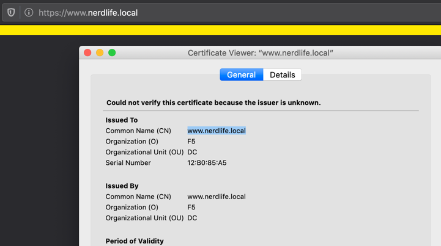
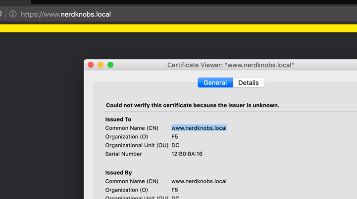
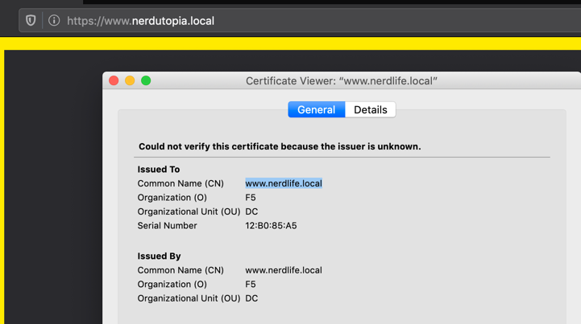
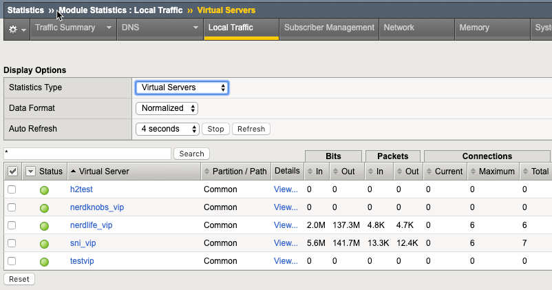
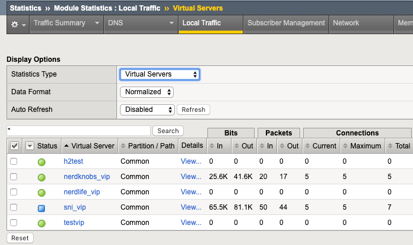

Description
===========

Background
----------

As shared in the [DevCentral article](https://devcentral.f5.com/s/articles/Project-Chain-Links-Introduction), 
DC Nerd Life, Inc has one public facing web application with an FQDN 
of www.nerdlife.local. This application is offloaded at their BIG-IP 
that has a single public IP address available to host the website and 
two servers serving content via the http protocol. The configuration
that needs to be altered can be found [here](before.txt).

The Problem
-----------

Management has an immediate requirement to stand up a new web
application with a different FQDN of www.nerdknobs.local. There is no
additional IP space for you to use. How do you manage this new
requirement?

Solutions
=========

Non-Intrusive Solutions
-----------------------

This is by far the easiest (albeit a legacy) solution: utilizing
multi-domain, also called unified communication certificates (UCC).
Price to purchase/grow/shrink and performance impacts on large lists are
some of the drawbacks. Chase's rule of thumb with this approach is to
combine UCC with wildcards, like so:

-   test.local

-   \*.lab.test.local

-   \*.demo.test.local

His advice is to avoid wildcarding the root so in the event of a
compromise, you can drop the subdomain without affecting the root.

Basic Architecture Solution
---------------------------

This is the solution I had in mind for the challenge, focusing on the
one tool to add to your toolbelt. It involves the SSL Profile and the
TLS SNI extension. SNI stands for server name indication and allows the
server-side of a TLS exchange to read the hostname the client is
requesting so the server can offer up the correct certificate. This
means that single-domain certificates can be used without issue.

On the BIG-IP side, nothing HAS to change on the server end (more on
that in the enhanced solution) assuming (as I did in the challenge) that
the servers can distinguish between applications and do not need help by
the infrastructure. The only configuration changes on the BIG-IP are to
the (number of) ssl profiles created and applied to the virtual server.

The recommended deployment for SNI results in 2+n ssl profiles, where n
is the number of domain-specific ssl certs you explicitly configure. In
this example, there are four clientssl profiles, one parent profile that
the other three will inherit from, one fallback profile that will be
served for hosts not matching a configured domain, and two supporting
the explicit domains of www.nerdlife.local
and www.nerdknobs.local. 

In the fallback
profile you configure the cert the unmatched host will receive and set
the sni-default option to true. In the explicitly defined profiles, you
configure the appropriate certs to match as well as the server-name
options. You can find all the configuration steps in [knowledge article
K13452 on AskF5](https://support.f5.com/csp/article/K13452), on which
this challenge is based.

The results of this [configuration](after.txt) are shown below when trying 
to reach each of the domains for this challenge, and then an unknown domain.

1.   Original domain - www.nerdlife.local

2.   Newly added domain - www.nerdknobs.local

3.   Uknown domain - www.nerdutopia.local

Notice on this last request that the fallback certificate is the one presented.

Enhanced Architecture Solution
------------------------------

This solution doesn't change anything transacting between the client and BIG-IP, 
but rather increases flexibility between the applications being serviced. With all
the applications being serviced by a single virtual server in the solution we've
already covered, any advanced services, like security, have to be shared. But if
we use a [vip targeting vip solution](https://devcentral.f5.com/s/articles/lightboard-lessons-vip-targeting-vip), 
then the virtual server that handles the TLS offloading can then pass the requests 
to a back-end virtual server specific to each application. 

The difference between 
the vip targeting vip solution in teh lightboard lesson and the one here is that 
we'll use a local traffic policy instead of the iRule. For the uninitiated, a policy
should almost always be preferred to an iRule as it is more performant and all the
options within a policy are supported, which is not always the case with an iRule. The
results of [this solution](after_enhanced.txt) when implemented can be seen in the virtual traffic stats in
the screenshots below.

Notice that this last request was rejected, as is consistent with our policy for server
names that do not match.

Now that it's clear you can pass traffic to unique back-end virtual servers, you can now
plan accordingly and apply services discriminantly as necessary. Huzzah!

Conclusion
----------

That's a wrap on challenge one! If you have another solution you'd like to share, 
feel free to issue a pull request and I'll review and add it! Comments would best 
be shared in the [DevCentral article](https://devcentral.f5.com/s/articles/Project-Chain-Links-Introduction).
